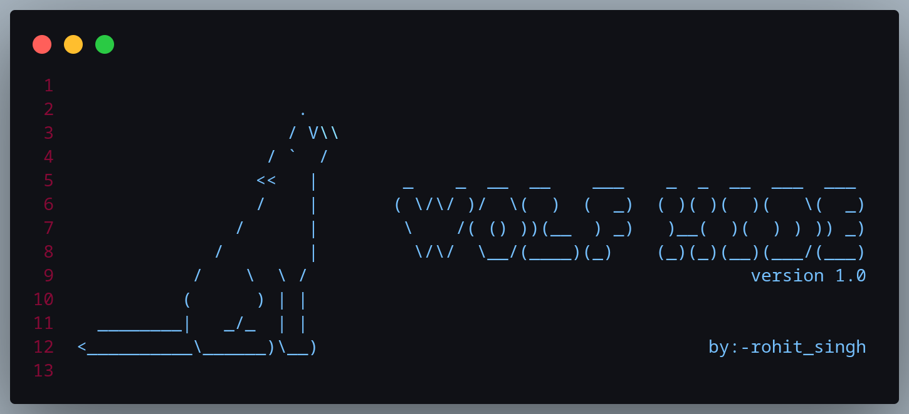

# Wolf Hide - The Hidden Power is Here
Wolf-Hide is a Command Line Image Steganography tool which hides the information into images and it supports many images extensions such as jpg, png, gif, etc. 

<b>Installation :</b> 

You need to install Python 3 For running this tool.

After installing python then you need to just type === pip install -r requirements.txt

<h3>Usage : </h3>

python wolfhide.py after executing this script then it requires image file path after entering path then it asks for output image file name as shown in the screenshots below.

In the same way if you want to decode then execute wolfdec.py by typing == python wolfdec.py after that provide the encoded image file (SECRET IMAGE) path then it decodes the encoded messages.

Check The Website <a href="https://wolfhide.netlify.app/" >wolfhide.netlify.app</a>

ScreenShots : 

